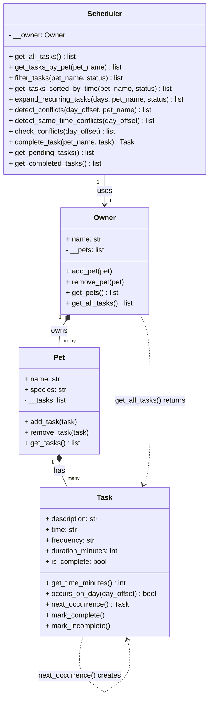

```mermaid
classDiagram
    class Task {
        + description: str
        + time: str
        + frequency: str
        + duration_minutes: int
        + is_complete: bool
        + get_time_minutes() int
        + occurs_on_day(day_offset) bool
        + next_occurrence() Task
        + mark_complete()
        + mark_incomplete()
    }

    class Pet {
        + name: str
        + species: str
        - __tasks: list
        + add_task(task)
        + remove_task(task)
        + get_tasks() list
    }

    class Owner {
        + name: str
        - __pets: list
        + add_pet(pet)
        + remove_pet(pet)
        + get_pets() list
        + get_all_tasks() list
    }

    class Scheduler {
        - __owner: Owner
        + get_all_tasks() list
        + get_tasks_by_pet(pet_name) list
        + filter_tasks(pet_name, status) list
        + get_tasks_sorted_by_time(pet_name, status) list
        + expand_recurring_tasks(days, pet_name, status) list
        + detect_conflicts(day_offset, pet_name) list
        + detect_same_time_conflicts(day_offset) list
        + check_conflicts(day_offset) list
        + complete_task(pet_name, task) Task
        + get_pending_tasks() list
        + get_completed_tasks() list
    }

    Owner "1" *-- "many" Pet : owns
    Pet "1" *-- "many" Task : has
    Scheduler "1" --> "1" Owner : uses
    Task ..> Task : next_occurrence() creates
    Owner ..> Task : get_all_tasks() returns
```
