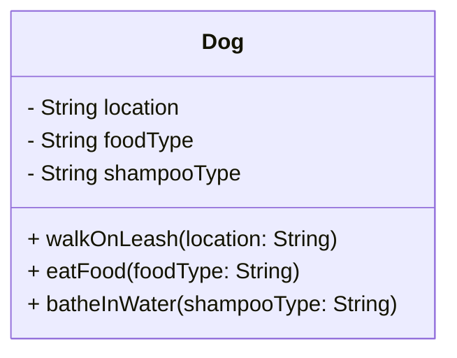

# PawPal+ Project Reflection

## 1. System Design

**a. Initial design**

- Briefly describe your initial UML design.
- What classes did you include, and what responsibilities did you assign to each?

Initial UML design such as walking the pet, feeding and bathing the pet these three core functions are important to the pawpal app for users to use and design overall. 

To describe the UML design, it is pretty good, but more details need to be added for this pet-scheduling app to be completed. Things like registering the user pets name, and adding tasks for pet and user to be complete is crucial. Right now, more details need to be added for Initial UML design to be correct. Responsibilities I assigned to each are Making sure the user registers the pet and themselves, and tasks like walking the pet public class, feeding as private classes the pet, and making sure that their pet is healthy by the owner and that the pet is caring for the owner. These three are the basic functions in keeping the animal in good condition.

STILL A: 
___________

Step 2: List Building blocks:
(Attributes)
 1. walking: the location
 2. feeding: type of food
 3. bathing: type of shampoo

 (methods)
 1. Dog on leash
 2. Eating food
 3. bathe in water

**b. Design changes**

- Did your design change during implementation?
- If yes, describe at least one change and why you made it.

Yes there is design changes during implementation,the change I made was to have the owner class available. Right now the dog class has its own care methods, but is a design miscmatch. An owner should hold reference to a Dog and call those methods.

## 2. Scheduling Logic and Tradeoffs

**a. Constraints and priorities**

- What constraints does your scheduler consider (for example: time, priority, preferences)?
- How did you decide which constraints mattered most?

The scheduler uses two separate conflict detection strategies: `detect_conflicts()` checks for overlapping durations, and `detect_same_time_conflicts()` checks for exact start-time matches. A more Pythonic version suggested by AI combined both into a single list comprehension — shorter code, but harder to read and debug because the intent of each check was buried in one dense expression.

**b. Tradeoffs**

The tradeoff I kept is **two explicit methods over one clever one**. Each method has a clear name, a clear job, and can be tested independently. The cost is slightly more code. The benefit is that a human reading the scheduler six months from now can understand what each detector does without mentally unpacking a nested comprehension.

A second tradeoff is that `detect_same_time_conflicts()` only flags tasks at the **exact same time string** (e.g. both at `"8:00 AM"`). It does not catch a case where one task starts at `"7:50 AM"` with a 20-minute duration and another starts at `"8:00 AM"`. That overlap is only caught by `detect_conflicts()`. Combining both into `check_conflicts()` means the full picture is still surfaced — but the two checks remain separate internally, which makes each one simpler to reason about and test.

## 3. AI Collaboration

**a. How you used AI**

- How did you use AI tools during this project (for example: design brainstorming, debugging, refactoring)?
- What kinds of prompts or questions were most helpful?

**b. Judgment and verification**

- Describe one moment where you did not accept an AI suggestion as-is.
- How did you evaluate or verify what the AI suggested?

---

## 4. Testing and Verification

**a. What you tested**

- What behaviors did you test?
- Why were these tests important?

**b. Confidence**

- How confident are you that your scheduler works correctly?
- What edge cases would you test next if you had more time?

---

## 5. Reflection

**a. What went well**

- What part of this project are you most satisfied with?

**b. What you would improve**

- If you had another iteration, what would you improve or redesign?

**c. Key takeaway**

- What is one important thing you learned about designing systems or working with AI on this project?
